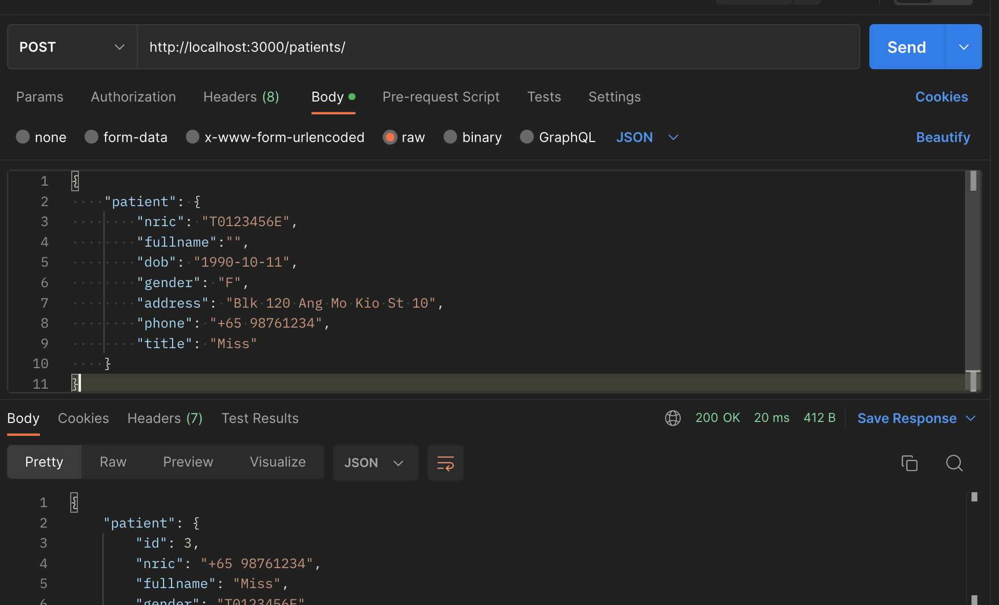

# API endpoints available (for deployed server):
(Prefix) Deployment URL for webpage: https://hicschatbot-dbservice.onrender.com

#### 1. Patients

1. Ping (for testing if the resource endpoint exists)
    * API endpoint: (prefix)**/patients/**
    * GET

1. Get all Patients
    * API endpoint: (prefix)**/patients/getAllPatients**
    * GET

1. Get a Patient by NRIC
    * API endpoint: (prefix)**/patients/getPatientByNric**
    * GET
    * (sample) request body: 
        ```
        {
            "nric": "T0123456A"
        }
        ```

1. Create a patient
    * API endpoint: (prefix)**/patients/**
    * POST
    * (sample) request body:
        ```
        {
            "patient": {
                "nric": "T0123456A",
                "fullname": "Alice Lee",
                "dob": "1990-10-11",
                "gender": "F",
                "address": "Blk 120 Ang Mo Kio St 10",
                "phone": "+65 91234567",
                "title": "Miss"
            }
        }
        ```

---
# Developer Docs for Backend Web App

## Architecture
1. Model 
    * Represents an entity in the database.
1. Controller
    * handles the (business) logic for the app.
1. Route: The API endpoints
    * validates and sanitizes the inputs.

1. Special classes:
    * controllers/validation.js: contains custom validation chain methods.
    * models/database.js: creates database representation object.

## Local Development
* For local development, you can create a PostgreSQL database running in a docker container. 
    1. install (docker)[https://docs.docker.com/get-docker/] and optionally: (Docker Desktop)[https://www.docker.com/products/docker-desktop/]
    1. cd into the directory that contains the `docker-compose.yml` file.
    1. Run: `docker-compose up -d` to create a running instance of PostgreSQL database in Docker and creates a `postgres-data` directory to store the database data.

    1. To check if the database is ready to accept connections: (in the container) go to 'Logs' and check that there is `LOG:  database system is ready to accept connections`
    1. With the container running and database ready to accept connections, go to terminal:
        1. log in to the database: `psql -U hicsbot`
            * "hicsbot" is the name of the database user (specified in docker-compose.yml)
        1. Can now execute sql queries!

* To easily be able to send and receive http requests (for working with endpoints), you can use Postman.
    1. install (postman)[https://www.postman.com/downloads/]
    1. In Postman Desktop app:
        1. Create a new collection and within it, add / create a new request
        1. Set:
            * HTTP request method
            * request URL
            * If data is provided in request body, choose: 'raw' and change from 'Text' to 'Json'
    

## Deployment
* Web app and PostgreSQL database will both be deployed to (Render)[https://render.com/]
